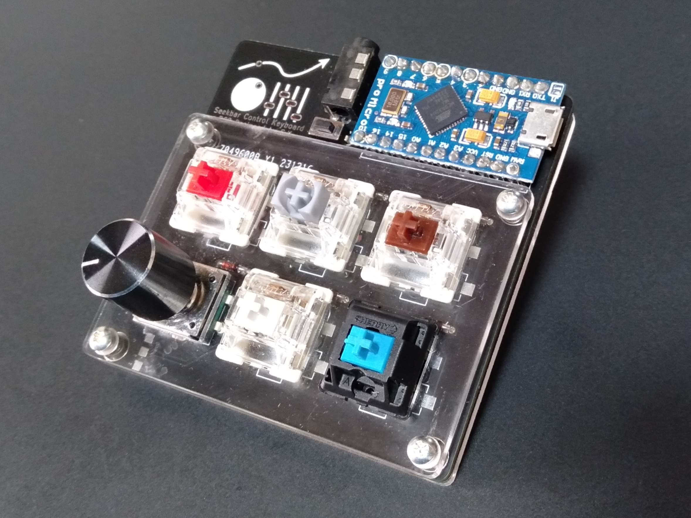
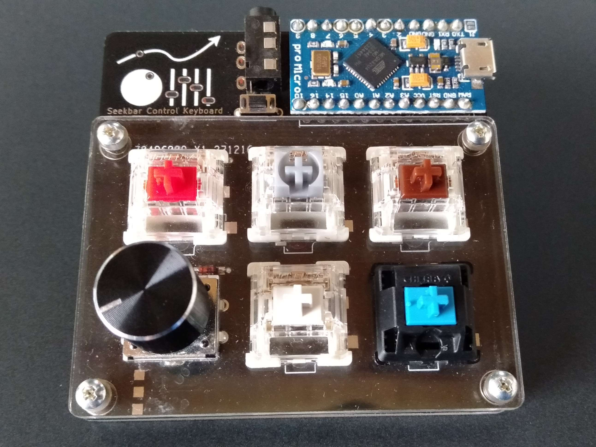

# SeekbarControlKeyboard



## 概要
- シークバー(音楽の再生、停止、スキップなど)を制御するためのキーボード
- 5スイッチ、1ロータリーエンコーダ(ボタン付き)
- 分割キーボード対応
- LED対応
- 完全オープンで、各自発注可能

## デフォルトキーマップ
```
┌───┬───┬───┐
│ A │ B │ C │
├───┼───┼───┤
│ D │ E │ F │ // Dはロータリーエンコーダ
└───┴───┴───┘
```

| key | single tap         | double tap     | other action   |
| --- | ------------------ | -------------- | -------------- |
| A   | 少し戻る           | 前のトラックへ |                |
| B   | 一時停止/再生      |                |                |
| C   | 少し進む           | 次のトラックへ |                |
| D   |                    |                | 回転で音量調節 |
| E   | ファンクションキー |                |                |
| F   | デバイスをスリープ |                |                |

## 部品
| parts                      | counts | sample value(en) |
| -------------------------- | ------ | ---------------- |
| PCB                        | 1      | 88               |
| アクリル版                 | 1      | 310              |
| ProMicro                   | 1      | 770              |
| ダイオード                 | 6      | 10               |
| キースイッチ               | 5      | 350              |
| ロータリーエンコーダ(EC12) | 1      | 330              |
| PCBソケット                | 5      | 94               |
| タクトスイッチ             | 1      | 22               |
| M2ボルト(12.6mm以上)       | 4      |                  |
| M2ナット(2mm)              | 8      | 35               |
| -- options --              |        |                  |
| ノブ                       | 1      |                  |
| キーキャップ               | 5      |                  |
| M2ワッシャー(0.5mm)        | 8      | 15               |
| クッションゴム             | 4      |                  |
| LEDシート                  | 1      | 550              |
| ジャック線                 | 1      | 330              |
| TRRSジャック(MJ-4PP-9)     | 1      | 165              |
| total                      |        | 2167             |
| options total              |        | 1060             |
